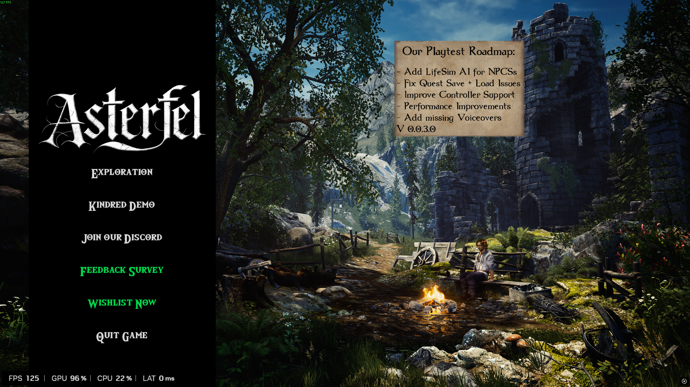
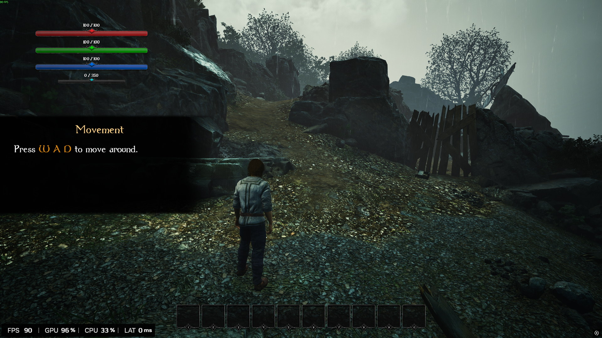
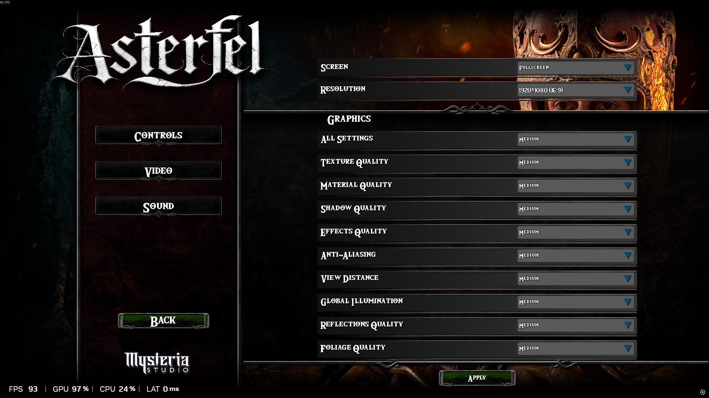

# QA Analysis: Asterfel (Playtest Phase)
**Tester:** Manuel Nuñez
**Date:** May 2026
**Hardware:** Ryzen 7 5700X3D | RTX 2070 Super | 24GB RAM | LEXAR NM790 1TB

## Executive Summary
Initial testing focused on **First Time User Experience (FTUE)**, **Accessibility**, and **UI/UX Consistency**.

## 1. Absence of a "Settings" menu on the Title Screen:
As a standard practice, players check settings before starting a session to align the game with their hardware specs. Forcing an automatic configuration upon starting a match can lead to poor performance (low FPS) or stability issues if the default settings are inadequate for the user's rig.

  

## 2. Tutorial and HUD Issues:
Keybinds: The movement tutorial only mentions "WAD", omitting the "S" key. This appears to be a documentation error, as WASD is the universal industry standard for PC gaming.

HUD Layout: The resource bars in the upper left corner occupy too much screen real estate, obstructing the player's field of view. A more minimalist or less invasive HUD would significantly improve the visual experience.

  

## 3. Video Settings & Accessibility:
The current video menu lacks essential features such as a Frame Rate Limiter (FPS Cap), Motion Blur toggle, and Camera Shake intensity. These options are vital for accessibility, especially for players who suffer from motion sickness or other health-related sensitivities. Implementing these is crucial for a professional user experience.

  

These are my initial impressions. I understand the game is in active development, and I provide this feedback to help refine the player's "First Time User Experience" (FTUE).
