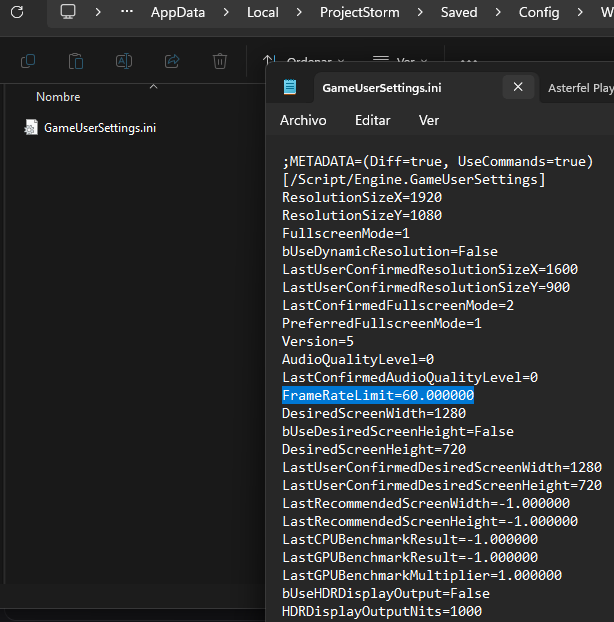

# Bug Report: Asterfel Playtest - May 2026

Technical bugs and feedback identified during the recent playtest session.

---

## 1. Missing FPS Limiter (Workaround found)

* **Category:** Optimization / Video Settings
* **The Issue:** In the video options, some fundamental settings are missing. Specifically, there is no option to limit FPS. 
* **The Workaround:** To fix this, I had to manually navigate to the game's `Saved` folder, open the `GameUserSettings.ini` file, and change `FrameRateLimit=0.000000` to `FrameRateLimit=60.000000`.

  

---

## 2. UI Overlay and Mouse Conflict (ESC vs. Note UI)

* **Category:** UI / Input Focus
* **The Issue:** When you open a note, the game is designed to be closed manually with the mouse cursor. However, if the player accidentally presses the `ESC` key (due to the classic RPG muscle memory of using ESC to close everything), the main options menu opens instead. The cursor is available to interact with that options menu, but once you close it and return to the game, the note remains open on screen and the mouse cursor completely disappears. Because the cursor is gone, you are unable to click the "X" to close the note.
* **The Workaround:** Opening the inventory forces the mouse cursor to reappear on the screen, allowing you to manually click and close the stuck note.

https://github.com/user-attachments/assets/17df55e8-d072-477c-8bbd-435ffa47436a

---

## 3. Health Regeneration Sleep Bug

* **Category:** State Persistence / Gameplay Logic
* **The Issue:** Sleeping to recover health doesn't seem to work properly. As shown in the attached video, I slept until the next morning, but after opening the inventory and unequipping/equipping an item, my health bar reverted back to the exact value I had before going to sleep.
* **Gameplay Impact:** Because the health recovery from sleeping doesn't persist after interacting with the inventory, players must rely on consumables and potions to actually restore their health.

https://github.com/user-attachments/assets/b24475f0-66a0-4e84-a581-62381095d451

---

## Performance Feedback

I really love the concept and direction of *Asterfel*. Regarding performance, I noticed constant FPS drops and stuttering throughout my session.

* **Test Environment Hardware Specs:**
  * **CPU:** AMD Ryzen 7 5700X3D
  * **GPU:** NVIDIA GeForce RTX 2070 Super
  * **RAM:** 32GB DDR4
